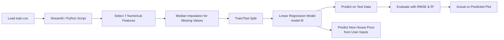

# 🏠 House Price Prediction — Linear Regression  
A machine learning system that predicts house sale prices using key property features.  
Built with **Python**, **Scikit-Learn**, and **Streamlit**.

---

## 📘 Project Summary  
This project uses **Linear Regression** to estimate house prices from essential property characteristics.  
The model is trained on the **Kaggle House Prices – Advanced Regression Techniques** dataset and includes:

- A clean 7-feature regression model  
- Proper data preprocessing and missing value handling  
- Evaluation metrics (RMSE & R²)  
- An interactive **Streamlit** app for real-time predictions  

Perfect for understanding supervised ML workflows, regression modeling, and deployment.

---

## 🚀 Features

### 📊 Linear Regression Model  
Uses **7 important numerical features** to predict house prices:
- `GrLivArea` — above-ground living area (sqft)  
- `BedroomAbvGr` — number of bedrooms  
- `FullBath` — number of full bathrooms  
- `LotArea` — lot size  
- `GarageCars` — capacity of garage  
- `OverallQual` — overall quality score  
- `YearBuilt` — year of construction  

### 🧼 Data Cleaning  
- Median imputation for missing values  
- Dropping rows with missing target (`SalePrice`)  
- 80/20 Train-Test split  

### 📉 Model Evaluation  
- **RMSE** (Root Mean Squared Error) — average error in dollars  
- **R²** — how much variance the model explains  
- Actual vs Predicted scatter plot  

### 🌐 Interactive Web Application  
- Built with **Streamlit**  
- Upload `train.csv`  
- Choose simple or extended model  
- View metrics and visualization  
- Predict new house prices by entering features  

---

## 🧠 How It Works (High-Level Architecture)

### 🙌 Author

Created and maintained by **Deepika**  
Passionate about AI, machine learning, and building meaningful projects.
